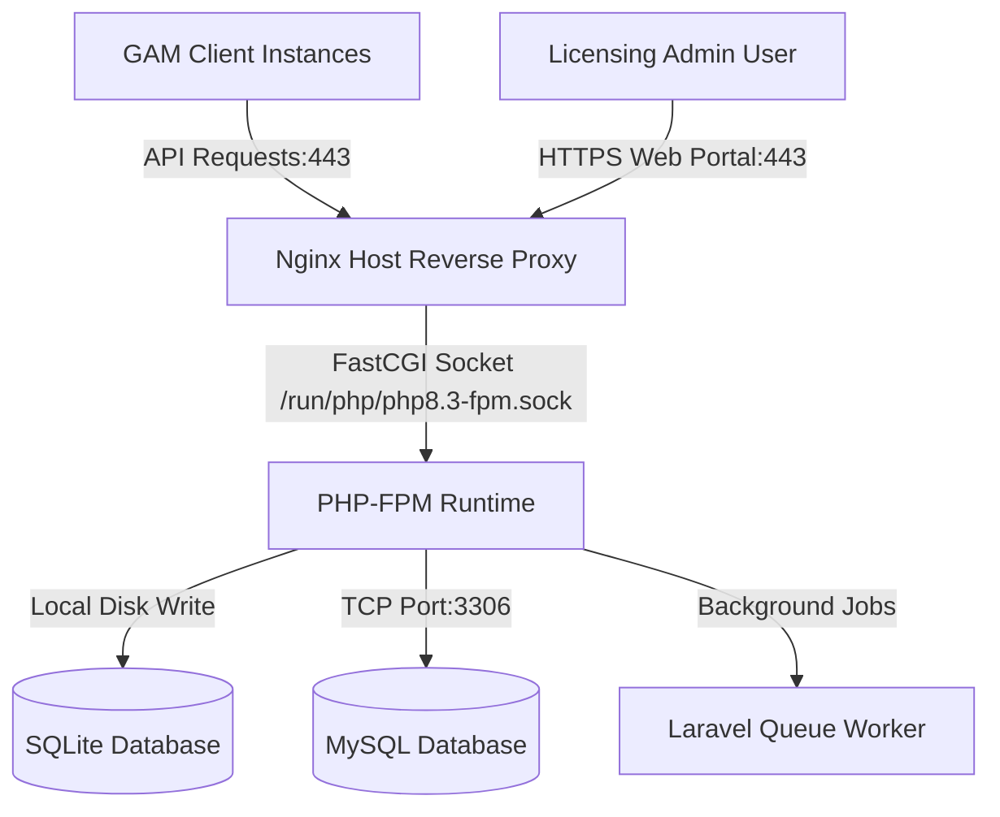

# Cloud Server Deployment Guide — Global License Manager
## Production Host LEMP (Linux, Nginx, MySQL, PHP) Stack Setup

This guide provides step-by-step instructions to deploy the **Global License Manager (GLM)** backend on a clean Cloud Server (VPS/VM) running **Ubuntu 22.04 LTS** or **Ubuntu 24.04 LTS**. 

This deployment uses a traditional, performance-optimized **LEMP stack** (Nginx, PHP-FPM, MySQL) and runs directly on the host system. It utilizes the interactive setup wizard (`php artisan app:install`) to verify system dependencies, configure database credentials, generate Ed25519 key pairs, and seed default admin accounts.

---

### Architecture Overview



### Table of Contents
1. [Server Provisioning & Initial Hardening](#1-server-provisioning--initial-hardening)
2. [Installing System Packages (PHP, Nginx, MySQL, Node, Composer)](#2-installing-system-packages-php-nginx-mysql-node-composer)
3. [Deploying Application Code & Folder Permissions](#3-deploying-application-code--folder-permissions)
4. [Setting Up the Database (MySQL or SQLite)](#4-setting-up-the-database-mysql-or-sqlite)
5. [Running the Interactive Installer Wizard](#5-running-the-interactive-installer-wizard)
6. [Configuring Host Nginx & Let's Encrypt SSL](#6-configuring-host-nginx--lets-encrypt-ssl)
7. [Configuring Supervisor Queue Worker](#7-configuring-supervisor-queue-worker)
8. [Configuring Task Scheduling (Cron)](#8-configuring-task-scheduling-cron)
9. [Post-Deployment Tasks & Diagnostics](#9-post-deployment-tasks--diagnostics)
10. [Automated Daily Backups](#10-automated-daily-backups)

---

### 1. Server Provisioning & Initial Hardening

#### Step 1.1: Choose VPS Provider & Specifications
Ensure your VPS meets or exceeds the following requirements:
* **Operating System**: Ubuntu 22.04 LTS or 24.04 LTS (x86_64)
* **Processor**: 1 vCPU minimum (2 vCPUs recommended)
* **Memory**: 2GB RAM minimum (4GB recommended for smooth Node/Vite asset compiling and queue management)
* **Storage**: 20GB+ SSD/NVMe

#### Step 1.2: System Update & User Configuration
Log into your server as root:
```bash
ssh root@your_server_ip
```
Update all system packages:
```bash
apt update && apt upgrade -y
```
Create a dedicated administrator user (e.g., `licenseadm`) and grant sudo privileges:
```bash
adduser licenseadm
usermod -aG sudo licenseadm
```

#### Step 1.3: SSH Hardening
Copy your local public SSH key to the server for the new user:
```bash
# Run this command on your local machine:
ssh-copy-id licenseadm@your_server_ip
```
Log in as `licenseadm` to verify key access, then open the SSH configuration:
```bash
sudo nano /etc/ssh/sshd_config
```
Modify these directives to disable root logins and password authentication:
```ini
PermitRootLogin no
PasswordAuthentication no
```
Restart the SSH service:
```bash
sudo systemctl restart ssh
```

#### Step 1.4: Firewall Configuration (UFW)
Secure open ports, allowing only SSH (22), HTTP (80), and HTTPS (443):
```bash
sudo ufw default deny incoming
sudo ufw default allow outgoing
sudo ufw allow 22/tcp
sudo ufw allow 80/tcp
sudo ufw allow 443/tcp
sudo ufw enable
```

---

### 2. Installing System Packages (PHP, Nginx, MySQL, Node, Composer)

#### Step 2.1: Add PHP Ondřej Surý Repository
Add the repository to install PHP 8.3/8.4 and necessary extensions.

> [!NOTE]
> Ondřej Surý packages are hosted on Launchpad PPAs for **Ubuntu**, but on `packages.sury.org` for **Debian**. Since PPAs are not natively supported on Debian, adding an Ubuntu PPA on a Debian machine will result in `404 Not Found` repository release errors. Follow the instructions below based on your server's operating system.

##### Option A: For Ubuntu (22.04 LTS / 24.04 LTS)
If you are running Ubuntu, install dependencies and add the PPA:
```bash
sudo apt update
sudo apt install -y software-properties-common python3-launchpadlib
sudo add-apt-repository ppa:ondrej/php -y
sudo apt update
```
*(Note: Installing `python3-launchpadlib` prevents potential `AttributeError: 'NoneType' object has no attribute 'people'` tracebacks during repository configuration on minimal installations).*

##### Option B: For Debian (Debian 12 Bookworm)
If you are running Debian, add the key and source configuration from the official Debian repository:
```bash
# 1. Install prerequisites
sudo apt update
sudo apt install -y apt-transport-https lsb-release ca-certificates curl gnupg2

# 2. Add GPG keyring and source list
curl -fsSL https://packages.sury.org/php/apt.gpg | sudo gpg --dearmor -o /etc/apt/trusted.gpg.d/sury-php.gpg
echo "deb https://packages.sury.org/php/ $(lsb_release -sc) main" | sudo tee /etc/apt/sources.list.d/sury-php.list

# 3. Update packages index
sudo apt update
```

> [!IMPORTANT]
> **PPA Cleanup:** If you previously attempted to add the Ubuntu PPA on a Debian server and encountered errors, you must clean up the broken source entry before running `apt update`, otherwise the update process will fail:
> ```bash
> sudo rm -f /etc/apt/sources.list.d/ondrej-ubuntu-php-*.list
> ```

#### Step 2.2: Install PHP & Extensions
Install your preferred PHP version along with the required extensions:

##### Option A: PHP 8.3
```bash
sudo apt install -y php8.3-fpm php8.3-cli php8.3-common php8.3-mysql php8.3-sqlite3 php8.3-curl php8.3-mbstring php8.3-xml php8.3-zip php8.3-gd php8.3-intl
```

##### Option B: PHP 8.4
```bash
sudo apt install -y php8.4-fpm php8.4-cli php8.4-common php8.4-mysql php8.4-sqlite3 php8.4-curl php8.4-mbstring php8.4-xml php8.4-zip php8.4-gd php8.4-intl
```

Verify the installation:
```bash
php -v
php -m | grep sodium
```

#### Step 2.3: Install Nginx & MySQL
```bash
sudo apt install -y nginx mysql-server
```
Secure the MySQL installation:
```bash
sudo mysql_secure_installation
```
*(Select password strength guidelines, configure a root password, and remove test databases/anonymous users).*

#### Step 2.4: Install Node.js & NPM
Vite requires Node.js to pre-compile the React frontend assets:
```bash
# Add NodeSource PPA for Node 20 LTS
curl -fsSL https://deb.nodesource.com/setup_20.x | sudo -E bash -
sudo apt install -y nodejs
```
Verify installation:
```bash
node -v
npm -v
```

#### Step 2.5: Install Composer
Download and install Composer globally:
```bash
curl -sS https://getcomposer.org/installer | php
sudo mv composer.phar /usr/local/bin/composer
sudo chmod +x /usr/local/bin/composer
```

---

### 3. Deploying Application Code & Folder Permissions

#### Step 3.1: Configure Deployment Directory
Create the application directory under `/var/www` and assign ownership:
```bash
sudo mkdir -p /var/www/global-license-manager
sudo chown -R licenseadm:licenseadm /var/www/global-license-manager
```

#### Step 3.2: Clone Codebase
Clone the project repository directly into the directory:
```bash
cd /var/www/global-license-manager
git clone <your-repository-url> .
```

#### Step 3.3: Set Up Laravel Directory Permissions
Laravel requires the web server user (`www-data`) to have write access to storage and cache directories:
```bash
sudo chgrp -R www-data storage bootstrap/cache
sudo chmod -R ug+rwx storage bootstrap/cache
```

---

### 4. Setting Up the Database (MySQL or SQLite)

Depending on your preference, you can run the License Manager on MySQL or local SQLite.

#### Option A: MySQL Server (Recommended for Production)
Log into the MySQL root console:
```bash
sudo mysql -u root
```
Create a new database and a secure database user:
```sql
CREATE DATABASE global_license_manager CHARACTER SET utf8mb4 COLLATE utf8mb4_unicode_ci;
CREATE USER 'glm_user'@'localhost' IDENTIFIED BY 'Arth@1992';
GRANT ALL PRIVILEGES ON global_license_manager.* TO 'glm_user'@'localhost';
FLUSH PRIVILEGES;
EXIT;
```

#### Option B: SQLite Database
If you wish to use SQLite:
```bash
touch database/database.sqlite
sudo chown -R licenseadm:www-data database
sudo chmod -R ug+rwx database
```

---

### 5. Running the Interactive Installer Wizard

The Global License Manager comes equipped with an automated interactive setup command (`php artisan app:install`) to configure the application.

#### Step 5.1: Install Composer Dependencies
Download and install PHP package dependencies:
```bash
composer install --no-dev --optimize-autoloader
```

#### Step 5.2: Launch the Installer Wizard
Run the command on your server terminal:
```bash
php artisan app:install
```

> [!TIP]
> If you wish to skip installing Node dependencies and compiling Vite assets (e.g., in CI environments or if you compile assets separately), you can append the `--no-assets` flag:
> ```bash
> php artisan app:install --no-assets
> ```

#### Step 5.3: Wizard Setup Prompts
Follow the interactive prompts:
1. **Requirements Check**: The script verifies that PHP, `ext-sodium`, `ext-pdo_mysql`, and directories are writable.
2. **Environment File**: Creates a `.env` file from `.env.example` if it does not already exist.
3. **Application URL**: Input your server URL (e.g. `https://license.yourdomain.com`).
4. **Database Configuration**:
   * Input the connection details (Host: `127.0.0.1`, Port: `3306`, Database: `global_license_manager`, Username: `glm_user`, Password: `your_secure_db_password_here`).
   * The installer automatically tests the database connection.
5. **Key Generation**: Builds standard application decryption keys.
6. **Migrations**: Executes database table schemas.
7. **Ed25519 License Key Pair Generation**:
   > [!IMPORTANT]
   > The wizard automatically generates the Ed25519 cryptographic key pair (`LICENSE_PRIVATE_KEY` and `LICENSE_PUBLIC_KEY`) and saves them to `.env`. 
   > 
   > Copy the outputted **`LICENSE_PUBLIC_KEY`**! You must paste this key into the `.env` file of all **Global Admission Manager (GAM)** client installations so they can decrypt and verify signatures. The **Private Key** must remain secret and stays only on this server.
8. **Admin User**: Setup the initial email and password for the Web Portal.
9. **Production Optimizations**: Compiles caches for configuration, routes, and views.
10. **Frontend Assets**: Installs npm dependencies (using `npm ci` if `package-lock.json` is present for faster builds) and builds Vite assets using `npm run build`. You can confirm or skip this interactively, and the command streams build output in real-time. If the `--no-assets` flag is passed, this entire step is skipped.

---

### 6. Configuring Host Nginx & SSL

Nginx will receive HTTPS connections, terminate SSL/TLS, and proxy requests to the local PHP-FPM socket.

#### Step 6.1: Disable Default Site Configuration
```bash
sudo rm /etc/nginx/sites-enabled/default
```

#### Step 6.2: Configure SSL & Nginx Server Block

Depending on whether you are using a Domain Name or a raw IP address, follow the appropriate sub-steps:

##### Option A: Deploying with a Domain Name (Let's Encrypt SSL)
Create the configuration file:
```bash
sudo nano /etc/nginx/sites-available/global-license-manager
```
Paste the following server block configuration (replace `license.yourdomain.com` with your domain name):
```nginx
server {
    listen 80;
    server_name license.yourdomain.com;
    root /var/www/global-license-manager/public;

    add_header X-Frame-Options "SAMEORIGIN";
    add_header X-Content-Type-Options "nosniff";

    index index.php;
    charset utf-8;

    location / {
        try_files $uri $uri/ /index.php?$query_string;
    }

    location = /favicon.ico { access_log off; log_not_found off; }
    location = /robots.txt  { access_log off; log_not_found off; }

    error_page 404 /index.php;

    location ~ \.php$ {
        fastcgi_pass unix:/var/run/php/php8.3-fpm.sock; # Match your PHP version socket path (e.g. php8.4-fpm.sock for PHP 8.4)
        fastcgi_param SCRIPT_FILENAME $realpath_root$fastcgi_script_name;
        include fastcgi_params;
    }

    location ~ /\.(?!well-known).* {
        deny all;
    }
}
```

Enable the configuration:
```bash
sudo ln -s /etc/nginx/sites-available/global-license-manager /etc/nginx/sites-enabled/
```
Verify syntax and restart Nginx:
```bash
sudo nginx -t
sudo systemctl restart nginx
```

Install Certbot and obtain the SSL certificate:
```bash
sudo apt install certbot python3-certbot-nginx -y
sudo certbot --nginx -d license.yourdomain.com
```
Follow the interactive prompts to automatically configure SSL and redirect HTTP traffic to HTTPS.

##### Option B: Deploying with a Raw IP Address (Self-Signed SSL)
Since Let's Encrypt does not issue free certificates for raw IP addresses, you must generate a self-signed SSL certificate on the server.

1. Generate a self-signed SSL certificate:
```bash
sudo openssl req -x509 -nodes -days 365 -newkey rsa:2048 \
  -keyout /etc/ssl/private/nginx-selfsigned.key \
  -out /etc/ssl/certs/nginx-selfsigned.crt \
  -subj "/CN=34.132.211.60"
```

2. Create the configuration file:
```bash
sudo nano /etc/nginx/sites-available/global-license-manager
```
Paste the following configuration configured for the IP address `34.132.211.60`:
```nginx
server {
    listen 80;
    server_name 34.132.211.60;
    return 301 https://$host$request_uri;
}

server {
    listen 443 ssl;
    server_name 34.132.211.60;

    ssl_certificate /etc/ssl/certs/nginx-selfsigned.crt;
    ssl_certificate_key /etc/ssl/private/nginx-selfsigned.key;

    # Safe SSL protocols and settings
    ssl_protocols TLSv1.2 TLSv1.3;
    ssl_ciphers HIGH:!aNULL:!MD5;

    root /var/www/global-license-manager/public;

    add_header X-Frame-Options "SAMEORIGIN";
    add_header X-Content-Type-Options "nosniff";

    index index.php;
    charset utf-8;

    location / {
        try_files $uri $uri/ /index.php?$query_string;
    }

    location = /favicon.ico { access_log off; log_not_found off; }
    location = /robots.txt  { access_log off; log_not_found off; }

    error_page 404 /index.php;

    location ~ \.php$ {
        fastcgi_pass unix:/var/run/php/php8.3-fpm.sock; # Match your PHP version socket path (e.g. php8.4-fpm.sock for PHP 8.4)
        fastcgi_param SCRIPT_FILENAME $realpath_root$fastcgi_script_name;
        include fastcgi_params;
    }

    location ~ /\.(?!well-known).* {
        deny all;
    }
}
```

3. Enable the configuration:
```bash
sudo ln -s /etc/nginx/sites-available/global-license-manager /etc/nginx/sites-enabled/
```
Verify syntax and restart Nginx:
```bash
sudo nginx -t
sudo systemctl restart nginx
```

---

### 7. Configuring Supervisor Queue Worker

The License Manager uses a database queue to process asynchronous jobs (like webhook logs, license verification tracking, and outgoing notification mailers). Use **Supervisor** to ensure the queue processes run continuously and restart automatically.

#### Step 7.1: Install Supervisor
```bash
sudo apt install supervisor -y
```

#### Step 7.2: Create Configuration File
Create a new configuration file:
```bash
sudo nano /etc/supervisor/conf.d/license-worker.conf
```
Paste the following configuration:
```ini
[program:license-worker]
process_name=%(program_name)s_%(process_num)02d
command=php /var/www/global-license-manager/artisan queue:work --sleep=3 --tries=3 --max-time=3600
autostart=true
autorestart=true
stopasgroup=true
killasgroup=true
user=licenseadm
numprocs=2
redirect_stderr=true
stdout_logfile=/var/www/global-license-manager/storage/logs/queue.log
stopwaitsecs=3600
```

#### Step 7.3: Load and Start Worker
```bash
sudo supervisorctl reread
sudo supervisorctl update
sudo supervisorctl start all
```
Check status:
```bash
sudo supervisorctl status
```

---

### 8. Configuring Task Scheduling (Cron)

Laravel's scheduler must run every minute to trigger recurring billing checks, key rotations, or daily metrics.

Open the system crontab for user `www-data`:
```bash
sudo crontab -u www-data -e
```
Add the following line at the bottom:
```cron
* * * * * php /var/www/global-license-manager/artisan schedule:run >> /dev/null 2>&1
```

---

### 9. Post-Deployment Tasks & Diagnostics

* **Caching Configurations**:
  Whenever code updates or `.env` parameters are changed in production, ensure caches are cleared and rebuilt:
  ```bash
  php artisan config:cache
  php artisan route:cache
  php artisan view:cache
  ```
* **Verify System Logs**:
  Ensure storage directories are capturing runtime errors:
  ```bash
  tail -f storage/logs/laravel.log
  tail -f storage/logs/queue.log
  ```

---

### 10. Automated Daily Backups

Ensure your license keys, active issued licenses, and system settings are backed up.

#### Step 10.1: Create Backup Script
Ensure the directory exists and create the script:
```bash
sudo mkdir -p /home/licenseadm
sudo nano /home/licenseadm/backup_license_manager.sh
```
Add the following script (replace credentials with your production configurations):
```bash
#!/bin/bash
BACKUP_DIR="/backups/license-manager"
DATE=$(date +%F_%H-%M-%S)

mkdir -p $BACKUP_DIR

# 1. Backup MySQL Database
mysqldump -u glm_user -p'your_secure_db_password_here' global_license_manager | gzip > $BACKUP_DIR/db_backup_$DATE.sql.gz

# 2. Backup .env File (Contains critical Ed25519 Private Key)
cp /var/www/global-license-manager/.env $BACKUP_DIR/env_backup_$DATE

# 3. Secure backups folder
chmod 600 $BACKUP_DIR/*
chmod 700 $BACKUP_DIR

# 4. Remove backups older than 30 days
find $BACKUP_DIR -type f -mtime +30 -delete
```

Make the script executable:
```bash
chmod +x /home/licenseadm/backup_license_manager.sh
```

#### Step 10.2: Configure Cron Backup Job
Open the root crontab:
```bash
sudo crontab -e
```
Add the following line to run the backup script every night at 3:00 AM:
```cron
0 3 * * * /home/licenseadm/backup_license_manager.sh >> /var/log/license_backup.log 2>&1
```
